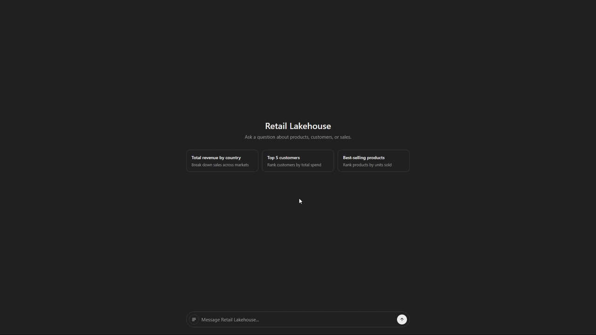

# databricks-retail-lakehouse

A retail lakehouse on Databricks, built end-to-end from the UCI "Online Retail" dataset (UK online retailer transactions, Dec 2010–Dec 2011): bronze → staging → marts pipeline, plus a text-to-SQL chat app over the marts.

Everything — Unity Catalog governance, schema/job deployment, transformations — is defined as code and deployed via CLI. No manual configuration in the Databricks UI, aside from one Free Edition restriction noted below.



## Architecture


- **Online Retail.xlsx**: source file, uploaded once to a Unity Catalog Volume (`bronze.raw_landing`).
- **Bronze notebook (PySpark)**: reads the file from the Volume, writes it as-is to `bronze.online_retail` — explicit schema, no business rules.
- **dbt (staging)**: renames, types, and adds a surrogate key — `staging.stg_online_retail`.
- **dbt (marts)**: builds the star schema — `dim_products`, `dim_customers`, `dim_dates`, `fct_sales`.
- **Text-to-SQL chat app (FastAPI + `ai_query`)**: lets anyone query the marts in plain English — the LLM only generates SQL, validated read-only before it ever runs.
- **Terraform**: provisions the Unity Catalog catalog (`retail`) and its grants — the one object the Bundle can't manage, since catalog creation is account-level, not workspace-level.
- **Databricks Asset Bundle**: provisions the schemas, volume, and the `retail_pipeline` job, and orchestrates the two chained tasks (bronze ingestion, then `dbt run` + `dbt test`).

## Stack

| | |
|---|---|
| Platform | Databricks Free Edition — Unity Catalog, serverless compute, SQL Warehouse, Foundation Model APIs |
| Governance | Terraform |
| Deployment | Databricks Asset Bundles |
| Ingestion | PySpark |
| Transformation | dbt-databricks |
| AI feature | FastAPI, `ai_query()` (Llama 3.1, served by Databricks) |

## Repo structure

```
terraform/                              Unity Catalog catalog + grants
orchestration/databricks_bundle/        Bundle resources (schemas, volume, job)
notebooks/                              Bronze ingestion + dbt runner notebooks
dbt/                                    dbt project (staging/marts models, tests)
app/                                    Text-to-SQL chat app (FastAPI + static frontend)
data/raw/                               Source dataset
```

## Running it

### Pipeline

Requires a Databricks workspace, the [Databricks CLI](https://docs.databricks.com/dev-tools/cli/index.html) configured (`databricks configure --token`), and [Terraform](https://developer.hashicorp.com/terraform/install).

```powershell
# 1. Unity Catalog governance
cd terraform
terraform init
terraform apply

# 2. Deploy schemas, volume, job
cd ..
databricks bundle deploy

# 3. Upload the dataset to the volume (one-off)
databricks fs cp "data/raw/Online Retail.xlsx" "dbfs:/Volumes/retail/bronze/raw_landing/Online Retail.xlsx"

# 4. Run the pipeline (bronze -> dbt staging -> dbt marts)
databricks bundle run bronze_ingestion
```

### Text-to-SQL chat app (local)

```powershell
pip install -r requirements.txt
$env:DATABRICKS_HOST = "<your workspace URL>"
$env:DATABRICKS_HTTP_PATH = "<your SQL Warehouse HTTP path>"
$env:DATABRICKS_TOKEN = "<your token>"
cd app
uvicorn main:app --reload
```

Open `http://127.0.0.1:8000`.

## How the text-to-SQL feature works

1. The question, together with a description of the `retail.marts` schema, is sent to a Databricks-hosted LLM via `ai_query()`.
2. The generated SQL is validated in Python before anything runs: single statement, `SELECT` only, no destructive keywords, restricted to the 4 marts tables.
3. Only a query that passes validation is executed on the SQL Warehouse — the LLM never gets direct database access.

## Notes

- Catalog creation is blocked via API/Terraform on Free Edition ("Please use the UI to create a catalog with Default Storage") — the catalog was created once via the UI, then `terraform import`ed, so every change since is code-managed.
- This workspace only supports serverless compute; the native Databricks `dbt_task` job type doesn't work here (fails on cluster launch), so the dbt step runs from a plain notebook task instead (`notebooks/02_dbt_transform.py`).

## Status

Bronze → staging → marts pipeline, orchestration, and the text-to-SQL app are all working end-to-end. Remaining: a recorded demo.
