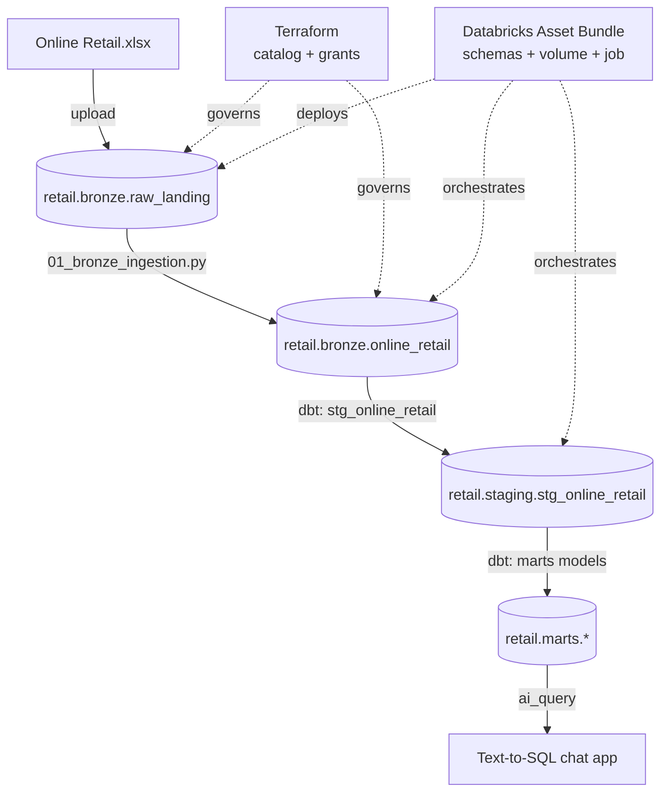

# Architecture

## Layers

| Layer | Owned by | Purpose |
|---|---|---|
| Volume (`raw_landing`) | Bundle | Landing zone for the raw source file, no processing |
| Bronze | Notebook (`01_bronze_ingestion.py`) | Raw ingestion, explicit schema, no business rules |
| Staging | dbt (view) | Rename, type, surrogate key — light cleaning |
| Marts | dbt (table) | Star schema: `dim_products`, `dim_customers`, `dim_dates`, `fct_sales` |
| App | FastAPI + `ai_query` | Natural language queries over the marts, read-only |

## Orchestration

A single Databricks Job, `retail_pipeline`, with two chained tasks:

1. `ingest_online_retail` — runs the bronze notebook
2. `dbt_transform` — runs `dbt run` + `dbt test` (via a notebook, not the native `dbt_task` — see [README Notes](../README.md#notes))

Triggered end-to-end with `databricks bundle run bronze_ingestion`.

## Governance

Terraform owns the Unity Catalog catalog (`retail`) and its grants — the only Unity Catalog object that can't be created via the Bundle (catalog creation is account/metastore-level, not workspace-level). Schemas, volume, and the job are Bundle resources.
